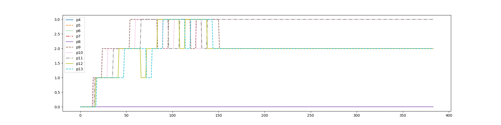

# XV6 Report

## System Calls

### Implementing `getreadcount`

- in `kernel/syscall.h`
  add the following entry

  ```h
  #define SYS_getreadcount 22
  ```

- in `kernel/syscall.c`

  - add the following line to the `syscall` array
    ```c
    [SYS_getreadcount] sys_getreadcount,
    ```
  - add the following line
    ```c
    extern int sys_getreadcount(void);
    ```

- in `kernel/proc.h`
  add a new attribute `readcount` to the `proc` structure

  ```h
  int readcount;        // number of times sys call read has been called
  ```

- in `kernel/sysproc.c`
  add the following function

  ```c
  int
  sys_getreadcount(void)
  {
      return myproc()->readcount;
  }
  ```

- in `kernel/proc.c`
  initialise the `readcount` attribute of the `proc` structure to 0 in the `allocproc` and `freeproc` functions

  ```c
  p->readcount = 0;
  ```

- in `kernel/syscall.c`

  - declare and initialise a variable `readcount`
    ```c
    int readcount = 0;
    ```
  - if the sys call `read` is called, update the readcount variable and if the sys call `getreadcount` is called, update the readcount attribute of the process
    ```c
    if(num==SYS_read)
        readcount++;
    if(num==SYS_getreadcount)
        p->readcount = readcount;
    ```

- in `user/user.h`
  add the following function definition

  ```h
  int getreadcount(void);
  ```

- in `user/usys.pl`
  added the following entry
  ```pl
  entry("getreadcount");
  ```

---

### Implementing `sigalarm` and `sigreturn`

- in `kernel/syscall.h`
  add the following entry

  ```h
  #define SYS_sigalarm 24
  #define SYS_sigreturn 25
  ```

- in `kernel/syscall.c`

  - add the following line
    ```c
    extern uint64 sys_sigalarm(void);
    extern uint64 sys_sigreturn(void);
    ```
  - add the following line to the `syscall` array
    ```c
    [SYS_sigalarm] sys_sigalarm,
    [SYS_sigreturn] sys_sigreturn,
    ```

- in `user/user.h`
  add the following function definition

  ```h
  int sigalarm(int, void* func);
  int sigreturn(void);
  ```

- in `user/usys.pl`
  added the following entry

  ```pl
  entry("sigalarm");
  entry("sigreturn");
  ```

- in `kernel/proc.h`
  add the following required new attributes to the `proc` structure

  ```h
  int numticks;                    // number of ticks the process has run for
  int alarmflag;                   // flag to check if alarm is set
  int interval;                    // number of ticks after which alarm handler is to be called
  uint64 handler;                  // function pointer for alarm handler
  struct trapframe *trapframecopy; // copy of trapframe for sigreturn
  ```

- in `kernel/proc.c`

  - update the `allocproc` function to initialise the new attributes
    ```c
    p->numticks = 0;
    p->alarmflag = 0;
    p->interval = 0;
    p->handler = 0;
    ```
  - updated the `freeproc` function as well

- in `kernel/sysproc.c`
  add the `sys_sigalarm` and `sys_sigreturn` functions

  ```c
  int
  sys_sigalarm(void)
  {
      int interval;
      argint(0, &interval);

      uint64 handler;
      argaddr(1, &handler);

      struct proc *p = myproc();
      p->numticks = 0;
      p->interval = interval;
      p->handler = handler;

      return 0;
  }

  int
  sys_sigreturn(void)
  {
      struct proc *p = myproc();

      memmove(p->trapframe, p->trapframecopy, sizeof(struct trapframe));
      p->alarmflag = 0;

      return 0;
  }
  ```

- in `kernel/syscall.c`
  the return value of `sigreturn` gets stored in `trapframe->a0` and so here, its value is being restored

  ```c
  if(num==SYS_sigreturn)
  {
      // restore a0
      p->trapframe->a0 = p->trapframecopy->a0;
      kfree((void*) p->trapframecopy);
  }
  ```

- in `kernel/trap.c`
  added code to update the number of ticks and handle accordingly
  ```c
  // give up the CPU if this is a timer interrupt.
  if (which_dev == 2)
  {
      if (p->interval > 0)
      {
          if(p->alarmflag==0)
          {
              p->numticks++;
              if (p->numticks == p->interval)
              {
                  p->numticks = 0;
                  p->alarmflag = 1;
                  p->trapframecopy = (struct trapframe *)kalloc();
                  *(p->trapframecopy) = *(p->trapframe);
                  p->trapframe->epc = p->handler;
              }
          }
      }
      yield();
  }
  ```
  note: `which_dev` being 2 indicates timer interrupt

## Scheduling Algorithms

in `Makefile`, the following lines were added

```make
ifndef SCHEDULER
SCHEDULER := RR         # setting the default scheduler to RR
endif
CFLAGS+="-D$(SCHEDULER)"
```

### Implementing FCFS

- in `kernel/proc.c`

  - added the following line to the `allocproc` function for updating creation time of process
    ```c
    p->ctime = ticks;
    ```
  - added the following line to the `freeproc` function
    ```c
    p->ctime = 0;
    ```
  - put the existing scheduling code inside an `#ifdef` block for round-robin scheduling
    ```c
    #ifdef RR
    // existing RR scheduling code
    #endif
    ```
  - added the following code for FCFS scheduling

    ```c
    #ifdef FCFS
    for(;;)
    {
        // Avoid deadlock by ensuring that devices can interrupt.
        intr_on();

        struct proc *firstproc = 0;

        for (p = proc; p < &proc[NPROC]; p++)
        {
            acquire(&p->lock);
            if (p->state == RUNNABLE)
            {
                if(firstproc == 0)
                {
                    firstproc = p;
                    continue;
                }
                if(p->ctime < firstproc->ctime)
                {
                    release(&firstproc->lock); // release the lock of the previous process as different process is already assumed to be first
                    firstproc = p;
                    continue;
                }
            }
            release(&p->lock);
        }

        p = firstproc;
        if(p > 0)
        {
            // Switch to chosen process.  It is the process's job
            // to release its lock and then reacquire it
            // before jumping back to us.
            p->state = RUNNING;
            c->proc = p;
            swtch(&c->context, &p->context);

            // Process is done running for now.
            // It should have changed its p->state before coming back.
            c->proc = 0;
            release(&p->lock);
        }
    }
    #endif
    ```

- in `kernel/trap.c`
  for FCFS scheduling, after the completion of process, we exit directly without yielding, unless it is the case of a timer interrupt

  ```c
  #ifndef FCFS

  if(which_dev == 2)
      yield();

  #endif
  ```

  note: `which_dev` being 2 indicates timer interrupt

  ```c
  #ifndef FCFS
  if (which_dev == 2 && myproc() != 0 && myproc()->state == RUNNING)
      yield();
  #endif
  ```

---

### Implementing MLFQ

- in `Makefile`, added to `OBJS`

  ```make
  $K/mlfq.o
  ```

- added `mlfq.h` to `kernel/`
  header file for MLFQ scheduling

  - declared the mlfq structure
  - declared the mlfq functions
  - defined the required mlfq variables, etc

- added `mlfq.c` to `kernel/`
  defined the mlfq functions

  - `initmlfq` - initialises the mlfq structure
  - `push` - pushes the process into the mlfq
  - `pop` - pops the process from the mlfq
  - `remove` - removes the process from the mlfq

- in `kernel/main.c`

  - included the `mlfq.h` header file
  - added the following line to the `main` function to initialise the mlfq structure
    ```c
    #ifdef MLFQ
      initmlfq();
    #endif
    ```

- in `kernel/proc.h`
  added the following attributes to the `proc` structure

  ```c
  #ifdef MLFQ
    int qwaittime; // time spent in the queue
    int qpresent;  // flag to check if process is present in the queue
    int qno;       // queue number
    int runtime;   // time spent running
  #endif
  ```

- in `kernal/proc.c`

  - included the `mlfq.h` header file
  - in the `allocproc` and `freeproc` functions, initialised the attributes
    ```c
    #ifdef MLFQ
      p->qwaittime = 0;
      p->qpresent = 0;
      p->qno = 0;
      p->runtime = 0;
    #endif
    ```
  - in the `scheduler` function, added the following code for aging, pushing into the queues properly, and scheduling

    ```c
    #ifdef MLFQ
      for (;;)
      {
        intr_on();

        // aging
        for (p = proc; p < &proc[NPROC]; p++)
        {
          acquire(&p->lock);
          if (p->qpresent)
          {
            p->qwaittime++;
            if (p->qwaittime >= AGEWHEN && p->qno > 0)
            {
              remove(p->qno, p);
              p->qwaittime = 0;
              push(p->qno - 1, p);
            }
          }
          release(&p->lock);
        }

        // pushing into current priority queue
        for (p = proc; p < &proc[NPROC]; p++)
        {
          acquire(&p->lock);
          if (p->state == RUNNABLE)
          {
            if (p->qpresent == 0)
            {
              if (mlfq.npq[0] < NPROC)
                push(0, p);
            }
          }
          release(&p->lock);
        }

        int q;
        for (q = 0; q < NMLFQ; q++)
        {
          if (mlfq.npq[q] > 0)
          {
            p = pop(q);
            if (p)
            {
              acquire(&p->lock);
              // process switch
              p->state = RUNNING;
              c->proc = p;
              // n scheduled
              swtch(&c->context, &p->context);
              c->proc = 0;
              release(&p->lock);
              break;
            }
          }
        }
      }
    #endif
    ```

- in `kernel/trap.c`

  - defined the timeslices for each queue
    ```c
    #ifdef MLFQ
      int timeslice[NMLFQ] = {1, 3, 9, 15};
    #endif
    ```
  - updated `usertrap()` function to update the runtime of the process and shift between queues accordingly

    ```c
    #ifdef MLFQ
      if (which_dev == 2)
      {
        struct proc *p = myproc();
        if (p && p->state == RUNNING)
        {
          p->runtime++;
          for (int i = 0; i < p->qno; i++)
          {
            if (mlfq.npq[i] > 0)
            {
              push(p->qno, p);
              yield();
            }
          }
          if (p->runtime >= timeslices[p->qno])
          {
            if (p->qno < NMLFQ - 1)
              push(p->qno + 1, p);
            else
              push(p->qno, p);
            yield();
          }
        }
      }

    #endif
    ```

  - updated `kerneltrap()` as well

    ```c
    #ifdef MLFQ
      struct proc *p = myproc();
      if (p)
      {
        if (p->state == RUNNING)
          p->runtime++;

        for (int i = 0; i < p->qno; i++)
        {
          if (mlfq.npq[i] > 0)
          {
            push(p->qno, p);
            yield();
          }
        }

        if (which_dev == 2)
        {
          if (myproc() && myproc()->state == RUNNING)
          {
            if (p->runtime >= timeslices[p->qno])
            {
              if (p->qno < NMLFQ - 1)
                push(p->qno + 1, p);
              else
                push(p->qno, p);
              yield();
            }
          }
        }
      }
    #endif
    ```

---

### Analysis

#### Schedulers' Performance Comparison

Note: For this comparison, the processes are set to run only on 1 CPU

| Scheduler                  | Average Runtime | Average Waittime |
| :------------------------- | :-------------: | :--------------: |
| Round-Robin (default)      |       16        |       165        |
| First-Come-First-Serve     |       32        |       144        |
| Multi-Level Feedback Queue |       15        |       158        |

#### MLFQ Scheduling Analysis

Queue Level vs Number of Ticks (for 1 CPU and age limit = 30) 
